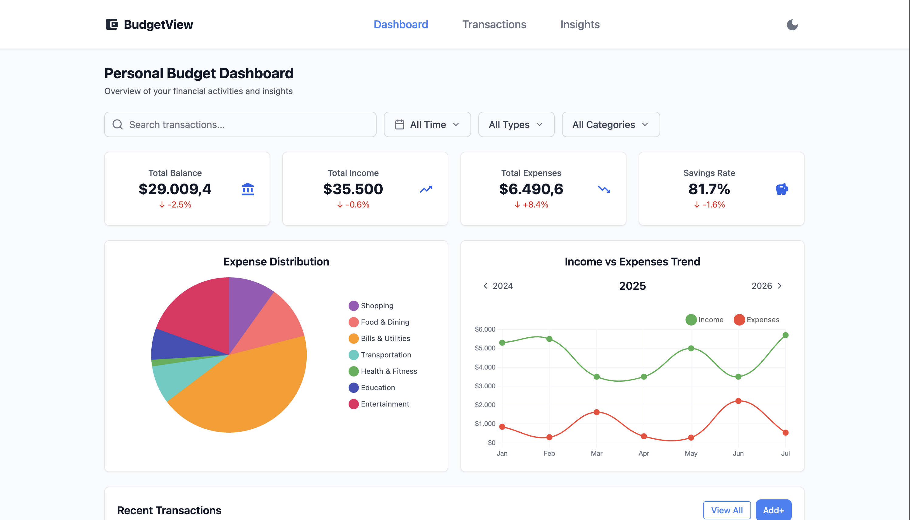
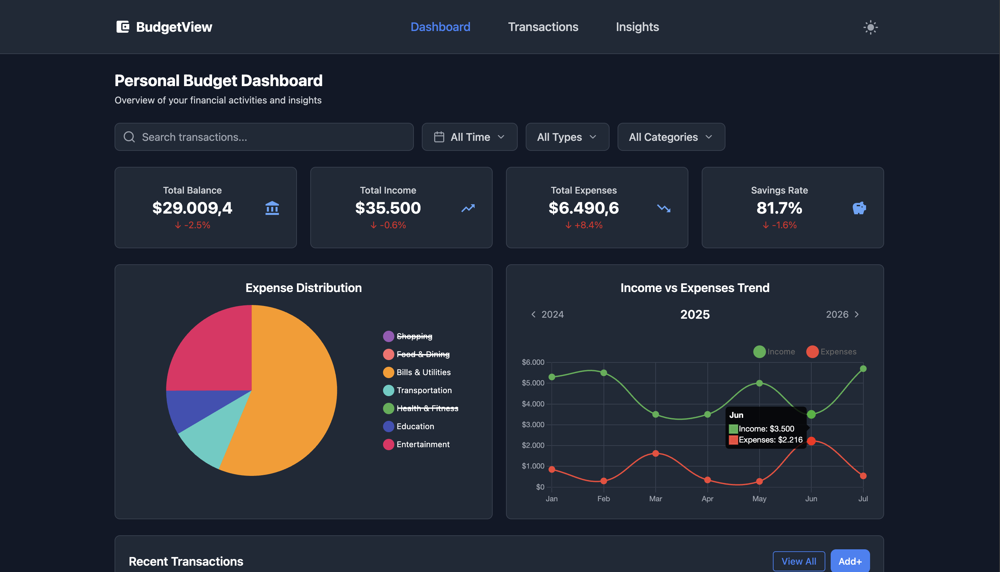
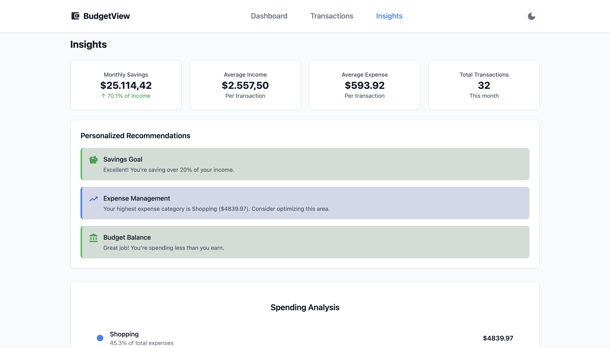
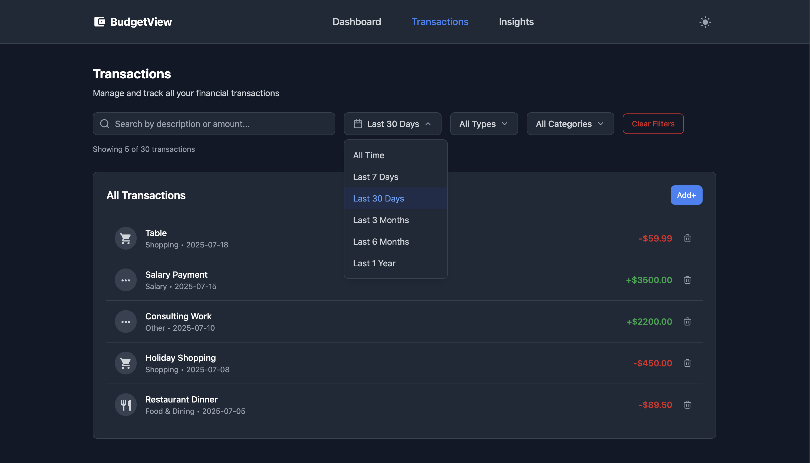
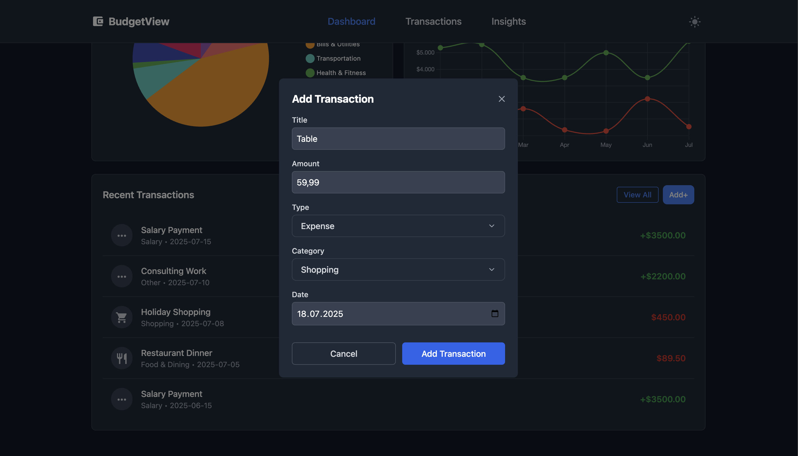

# Personal Budget Dashboard - BudgetView

## 🧠 About

Hi! I'm Utku, and this project is part of my personal portfolio.  
I built **BudgetView** to practice and showcase my skills in modern React development, data visualization, and UI design.  
While it’s not a production app, I’ve focused on clean structure, responsiveness, and interactive elements that simulate real-world scenarios.

Feedback and ideas are always welcome!

---

## ✨ Features

- 🖥️ **Dashboard Overview**: Track income, expenses, savings, and distribution at a glance.
- 📊 **Interactive Visualizations**: Dynamic charts and graphs (e.g. income vs expenses,   category distributions) with real-time updates and toggleable data series.
- 📅 **Transaction Filters**: Filter by time, type, or category.
- ➕ **Add Transaction Modal**: Easily add income or expense records via a clean form.
- 📈 **Insight Engine**: Auto-generated recommendations based on your financial behavior.
- 📱 **Responsive Design**: Fully optimized for desktop and mobile devices.
- 🌗 **Dark / Light Mode**: Seamless theme toggle for accessibility and visual preference.

---

## 📌 Tech Stack

| Technology   | Purpose                   |
|--------------|---------------------------|
| **React**         | Frontend library          |
| **Vite**          | Development build tool    |
| **Tailwind CSS**  | Styling framework         |
| **MUI Icons**     | UI icons                  |
| **Chart.js**      | Data visualizations       |

---

## 📸 Screenshots

### Dashboard Overview (Light Mode)


### Interactive Chart View (Dark Mode)


### Financial Insights & Recommendations (Light Mode)


### Transactions & Filtering System (Dark Mode)
 

### Add Transaction Modal (Dark Mode)


---

## 🚀 Getting Started

Clone the repository and start the dev server:

```bash
npm install
npm run dev
```
---
## 📬 Connect with Me
[LinkedIn – Ali Utku Kaba](https://www.linkedin.com/in/ali-utku-kaba)


